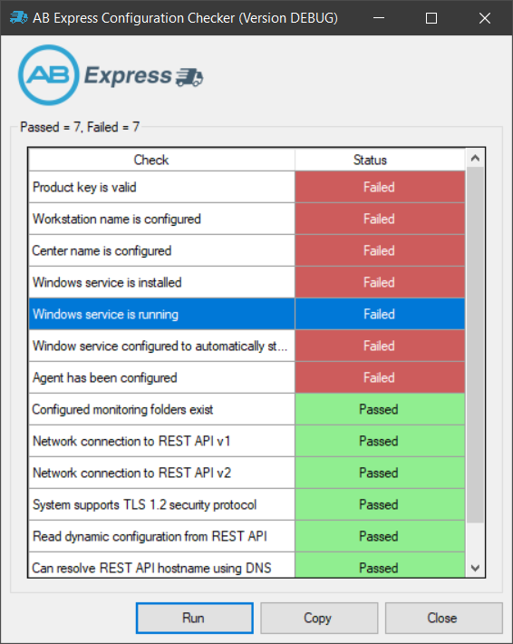
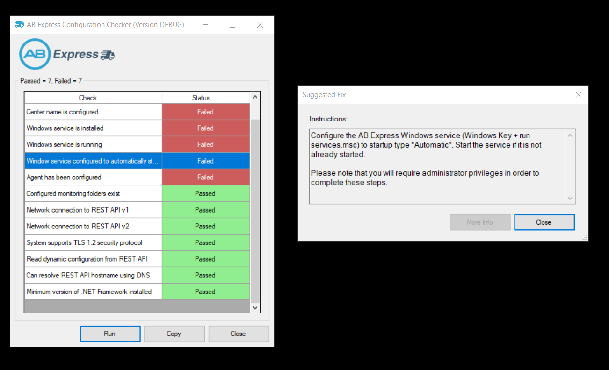
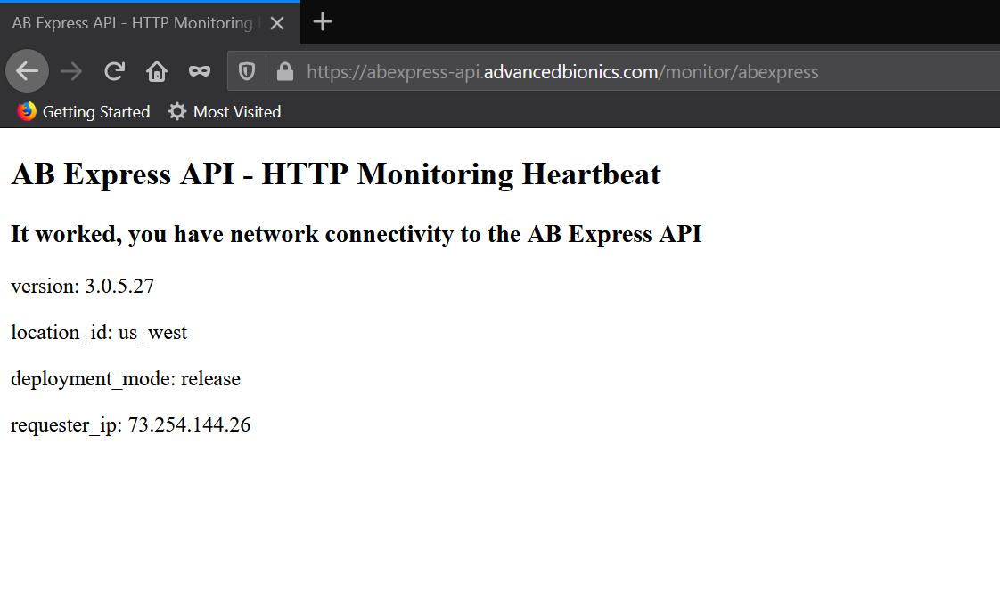
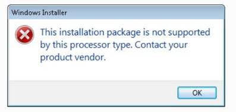
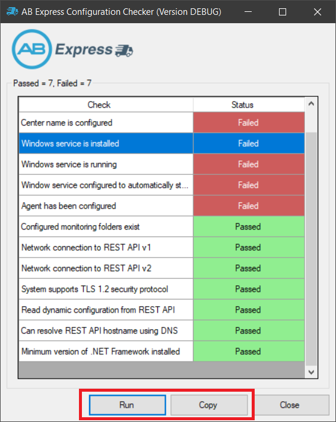

# abexpress-debugtool
This is the temporary home for the AB Express configuration checker tool. It looks for common issues with AB Express installations and configurations and provides suggested fixes. 



## Quick Links
- [Installation and Usage](#installation-and-usage)
- [Video Tutorial](#video-tutorial)
- [Automated Checks](#automated-checks)
- [Known Issues](#known-issues)
- [I need more help](#i-need-more-help)


## Installation and Usage
````
The latest version of the tool is 2.0.1.31b
````

This site is packaged with the latest version of the AB Express configuration tool, to get the tool:

1. Click on the green **Clone or download** button on the top-right and select **Download ZIP**, this will download this entire guide and the tool OR you can just [click this link](https://github.com/IronBox/abexpress-debugtool/archive/master.zip).
2. Unzip the ZIP archive into a folder on the system that you troubleshooting AB Express on. The tool will be the folder `configchecktool`.
3. Run **ABExpressConfigCheckerTool.exe** 
4. Click the Run button to start configuration checking (it may take a few moments to complete execution of tests)

Any check that has failed will be shown in red. Click on any failed check to view the suggested fix for the detected issue. Re-run the tool after you have fixed the issue to verify the fix.



### Command-line (Advanced)
If you prefer, you can run the tool from the command line. Simply specify the /console switch to run tests. Test raw data will be copied into your clipboard automatically.
````
ABExpressConfigCheckerTool.exe /console
````

### Requirements
- .NET Framework 4.6.1+ (this should be already installed on almost all Windows machines)
- Administrator access is not required; however, many fixes require administrator-level access

## Video Tutorial
A video tutorial on how to use the AB Express configuration checker tool can be found by [clicking here](https://1drv.ms/v/s!AvumAN_zgZ2wgYEu2F9OccQJSxWKeQ?e=oDbQKh).

## Automated Checks
The configuration checker tool checks for the following common issues. Please note that the fix for all of the following will require administrative privileges on the system.

### `Product key is valid`
This check analyzes the configured product key from the registry to ensure that is a valid key. If a key has not been entered via the administrator configuration tool or has been tampered with directly in the registry, this check will fail.

#### How to fix:
Use the administrator configuration tool to enter a valid product key. You can obtain a key by signing into [www.abproportal.com](https://www.abproportal.com).


### `Workstation name is configured`
Each AB Express requires a workstation name. It can be anything, such as the name of the computer (recommended). This is entered in using the administrator configuration tool.

#### How to fix:
Use the administrator configuration tool to enter a valid workstation name.

### `Center name is configured`
AB Express requires a center name to be configured. This should be the name of the health care provider, such as "UCLA"

*Note: As of version 2.x, a center name is no longer required*
#### How to fix:
Use the administrator configuration tool to enter a center name.

### `Windows service installed`
This check verifies that the AB Express Windows service is installed on the system. When this check fails it means that the Windows service component of AB Express was not installed.

#### How to fix:
Install or re-install AB Express entirely.

### `Windows service is running`
This check verifies that the AB Express Windows service is installed on the system and running.

#### How to fix:
There are a few ways to restart the Windows service (note that administrator privileges is required for all fix methods):

__Method 1 (Windows UI, Recommended)__
1. Press the Windows key
2. Type `services.msc`
3. Right click on the Services app and select `Run as administrator`
4. Right click on the service named **AB Express Client Service** and click Start


__Method 2 (Command prompt, advanced)__
1. Press the Windows key
2. Type `cmd`
3. Right-click the Command Prompt app and select `Run as administrator`
4. Enter the following command to start the AB Express service `sc start abexpressclient`


### `Windows service is configured to automatically start`
The AB Express service needs to be configured to automatically start when the system starts.

#### How to fix:
To fix this, do the following (requires administrator privileges):

1. Press the Windows key
2. Run "services.msc".
3. Right click on the service named **AB Express Client Service** and select Properties.
4. Change the **Startup Type** to **Automatic**
5. Start the service if it is not already started

### `Windows service uses correct startup account`
The AB Express service requires LocalSystem as its startup account, because it requires special privileges for accessing and modifying certain AB SoundWave and other backup files.

#### How to fix:
To fix this, do the following (requires administrator privileges):

1. Press the Windows key
2. Run "services.msc".
3. Right click on the service named **AB Express Client Service** and select Properties.
4. Change the **Logon as** to **System or LocalSystem**
5. Restart the service

### `Agent has been configured`
This check verifies that the AB Express service has been configured with the administration tool.

#### How to fix:
Use the administrator configuration tool to fully configure the AB Express service.

### `Configured monitoring folder exists`
AB Express can be configured to monitor custom folders. This check will fail when AB Express has been configured in this manner, but the actual folder/directory does not exist on the system.

#### How to fix:
Run the configuration checker tool and click on the failed check. The tool will show you a list of folders that have failed this check. Ensure that the listed folders exist on the system.

### `Network connection to REST API v1 and v2`
These checks verify that the system is able to make a network connection to the AB Express REST API servers. Being able to do so is critical for the successful operation of the AB Express service.

#### How to fix:
Fixing this issue will likely require the assistance of the center's network IT team. If the network connection is being blocked, it could be due to one or more of the following issues:

- Blocked at the perimeter firewall
- Blocked by anti-malware software
- The center's network is not configured to trust the signing certificate authority of the AB Express TLS certificate

Please ask the center's network IT team to help enable external access to the AB Express REST API servers. You can send the following description to the center's network IT team and they will understand what to do:

`The system where AB Express is installed on does not appear to be able to connect to the following REST API servers: abexpress-api.advancedbionics.com and dx-api.ironbox.app on TCP port 443 (TLS 1.2).`

You can manually verify connectivity by:
1. Open any modern browser, such as Chrome, Firefox, Edge. Please note that Internet Explorer is not recommended as it is no longer supported.
2. Browse to [https://abexpress-api.advancedbionics.com/monitor/abexpress](https://abexpress-api.advancedbionics.com/monitor/abexpress)   (REST API v2) or [https://dx-api.ironbox.app/monitor/abexpress](https://dx-api.ironbox.app/monitor/abexpress) (REST API v1) and you should see a screen like the following with no errors:




### `System supports TLS 1.2 security protocol`
The AB Express service uses the transport-layer security (TLS) protocol version 1.2 for securely sending data. This is the industry standard and 1.2 is the minimum version supported. If the system does not appear to support this protocol, then this check will fail.

Often times a system will fail this check due to the following:
- Missing latest security patches
- Operating system is too old (TLS is automatically supported on Windows 8 and higher)
- It has been disabled by network administrators explicitly
- The minimum version of .NET Framework 4.6.1 is missing

#### How to fix:
Fixing this issue will likely require the assistance of the center's network IT team. Please direct them to the following link:

[How to enable TLS on client machines](https://support.microsoft.com/en-us/help/3140245/update-to-enable-tls-1-1-and-tls-1-2-as-default-secure-protocols-in-wi)

### `Read dynamic configuration from REST API`
The AB Express service reads certain settings from the REST API. This check will typically fail if the system is unable to communicate with either v1 or v2 of the AB Express REST API service.

#### How to fix:
Please see the resolution for `Network connection to REST API v1 and v2`.


### `Can resolve REST API hostname using DNS`
In order for a system to communicate with the AB Express service, it needs to be able to *resolve* the hostname of the AB Express service. This is done using the local network DNS service.

#### How to fix:
You will need to work with the network IT team. You can let them know the following:

`The system is unable to resolve the DNS hostnames for either abexpress-api.advancedbionics.com or dx-api.ironbox.app`

### `Minimum version of .NET Framework installed`
AB Express requires Microsoft .NET Framework 4.6.1 or higher to function. The the .NET Framework is a set of libraries and functions developers use to build applications with. Typically this library is present on all Windows systems, but it may have been uninstalled or the version of Windows on the machine is extremely old.

#### How to fix:
Please install the latest version of the .NET Framework from [Microsoft .NET Framework download page](https://dotnet.microsoft.com/download/dotnet-framework).

You may need to work with the center's IT team to do this (recommended) as they will have software policies that need to be followed.

### `Security protocols disabled` or `Security protocols (default) disabled`
AB Express requires certain security protocols to be enabled by the operating system, namely TLS1.2 or above. If these protocols are disabled explicitly or by default, it will affect the ability of AB Express to communicate securely to REST APIs.

#### How to fix:
Please reach out to the AB Express team if you see this warning and they will let you know if the disabled protocol will affect AB Express or not. If it does, work with the center's IT team to determine if TLS1.2 or higher can be enabled by their software policy. 

Please refer to [Microsoft's documentation](https://docs.microsoft.com/en-us/windows-server/security/tls/tls-registry-settings#tls-12) for information on how to enable security protocols by the registry.


## Known Issues
- The 1.0.0.73 AB Express client installer is 64-bit only, and will not install on Windows 32-bit (this issue is fixed for future versions of AB Express)



## I need more help!
If after trying suggested fixes you are still unable to get AB Express to function, please contact the AB Express team. Before you do, please run the following steps which will provide the team with the necessary diagnostics information:

1. Start the configuration checker tool
2. Click the **Run** button to allow the tool to analyze the system.
3. Click the Copy button, this will convienently copy the diagnostics information to the system clipboard (which you can save to a file or paste into an email)
4. Send the AB Express team the diagnostics information


